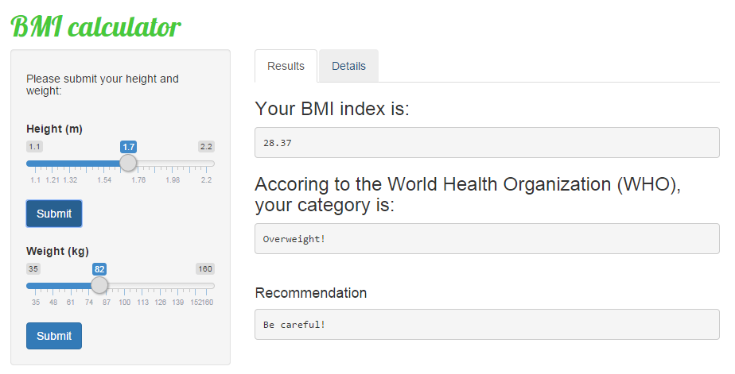

---
title       : Body Mass Index (BMI) Calculator
subtitle    : 
author      : iKangas
job         : 
framework   : io2012        # {io2012, html5slides, shower, dzslides, ...}
highlighter : highlight.js  # {highlight.js, prettify, highlight}
hitheme     : tomorrow      # 
widgets     : [mathjax, quiz, bootstrap]
mode        : selfcontained # {standalone, draft}
knit        : slidify::knit2slides
logo        : bmi.jpg

--- bg:#c0bcf5

## Body Mass Index

- The body mass index (BMI), or Quetelet index, is a measure of relative size based on the mass and height of an individual.
<br />
<br />
- The index was devised by Adolphe Quetelet.
<br />
<br />
- The BMI of an individual can be used as a simple method to assess how much the recorded body weight departs from what is healthy or desirable for a person of that height.

<div class='source'>
  Source: <a href='http://en.wikipedia.org/wiki/Body_mass_index'>Wikipedia</a>
</div>

--- bg:#c0bcf5

## BMI Calculator
- We provide an app where the user inputs his height and weight and he/she finds out the according BMI.
<br />
- The BMI for a person is defined as their body mass divided by the square of their height. 
<br />
- Thus, it is given by the following equation: $$\LARGE \frac{mass}{height^2} $$
- The calculation in R is performed as:
```{r,eval=FALSE}
bmi <- weight/(height**2)
```
- Note: The unit of mass is kilograms (kg) and the unit of height is meter (m)

--- bg:#c0bcf5

## Results

- In most cases, users are not able to interpret the index.
<br />
<br />
- In addition to BMI, the category into which the user falls, is shown. Some example categories are:

      BMI         |               Category
------------------|--------------------------------------
from 15.0 to 16.0 | Severely underweight
from 18.5 to 25   | Normal (healthy weight)
over 40           | Obese Class III (Very severely obese)

<br />
- Finally, a recommendation message is displayed to the user based on his/hers category.

--- bg:#c0bcf5

## Snap Shot

To sum up, we present a snap shot of the app where the user is 1.70 cm tall and weights 82 kg.

<div style='text-align: center;'>
    
</div>
